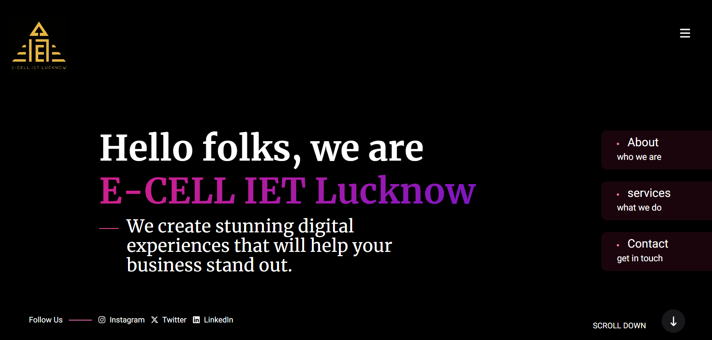
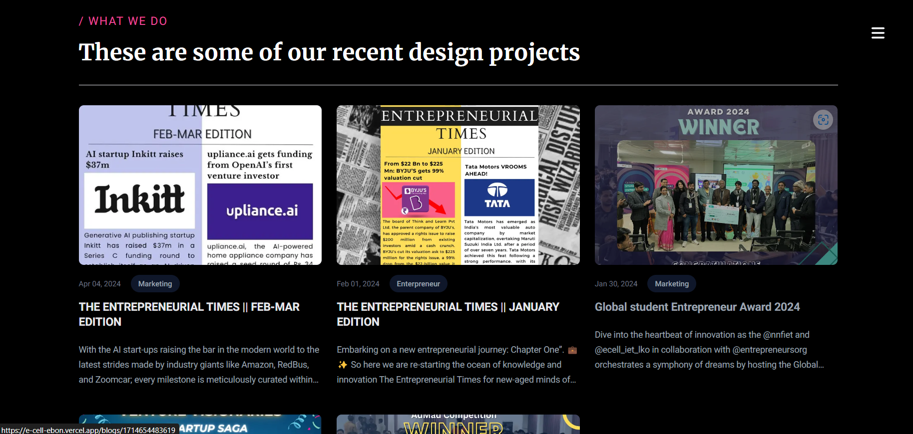
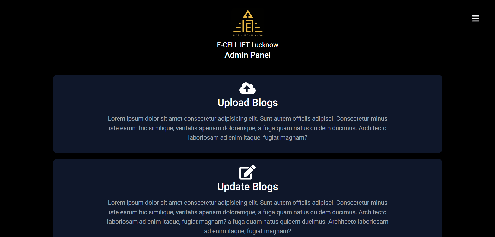
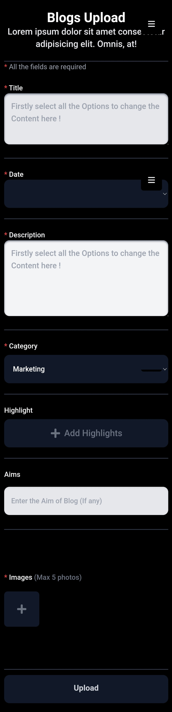

# [E-Cell Website](https://e-cell-ebon.vercel.app/)

## About

This website is designed to manage and promote the activities of the Entrepreneurship Cell (E-Cell) at our college. It serves as a platform for students to explore entrepreneurship, get updates on events, read blogs, and engage with the E-Cell community. The admin section allows authorized members to manage content efficiently.

### Key Features:
- Dynamic home page showcasing events and news.
- Blog section with articles written by members.
- Admin panel for easy content management.
- Team members section displaying the core members of E-Cell.

## Tech Stack

The website is built using the **NEXT JS**

## Screenshots

### Home Page

The home page provides an overview of the latest E-Cell events, announcements, and news. It is designed to keep users updated with the most recent information regarding entrepreneurial activities and opportunities.

### Blogs Page

This page features blog posts written by E-Cell members, sharing their insights, experiences, and knowledge related to entrepreneurship. It allows users to read and explore various articles that help foster an entrepreneurial mindset.

### Admin Panel

The admin panel offers a dashboard for managing website content. Authorized members can add, edit, or remove events, blog posts, and other relevant information with ease, ensuring the website stays updated.

### Content Upload Section

This section allows admins to upload and manage content, including blogs, announcements, and media files. It features an intuitive interface to streamline the content management process.

### Team Members Page

The team members page introduces the core members of the E-Cell, highlighting their roles and contributions. It provides insights into the people driving the entrepreneurship initiatives within the college.
